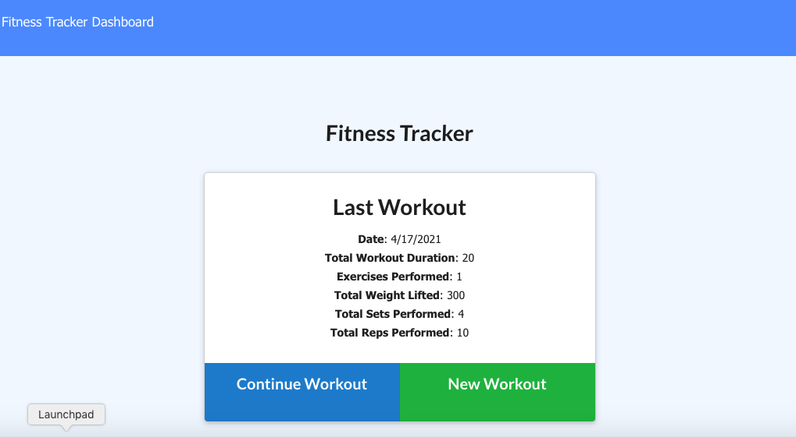
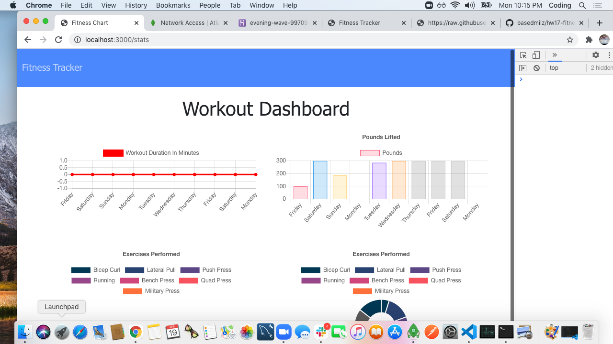
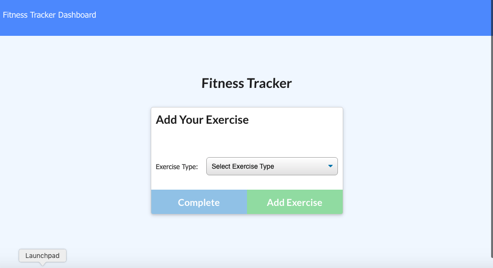

# Fitness Tracker

## Description 

Using MongoDb you can add, save, and track your weekly workouts from the options of cardio and resistance training.

## Screenshots

## Technologies used

* HTML
* CSS
* JavaScript
* Node.js
* MongoDB
* Express

## Repository

  - [Repo](https://github.com/basedmilz/hw17-fitness-tracker)
